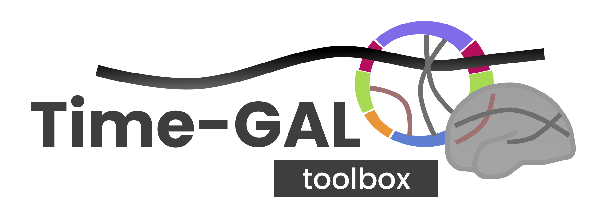
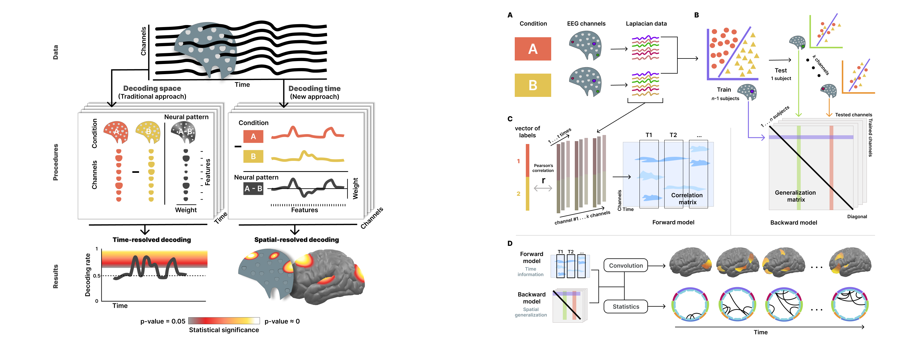
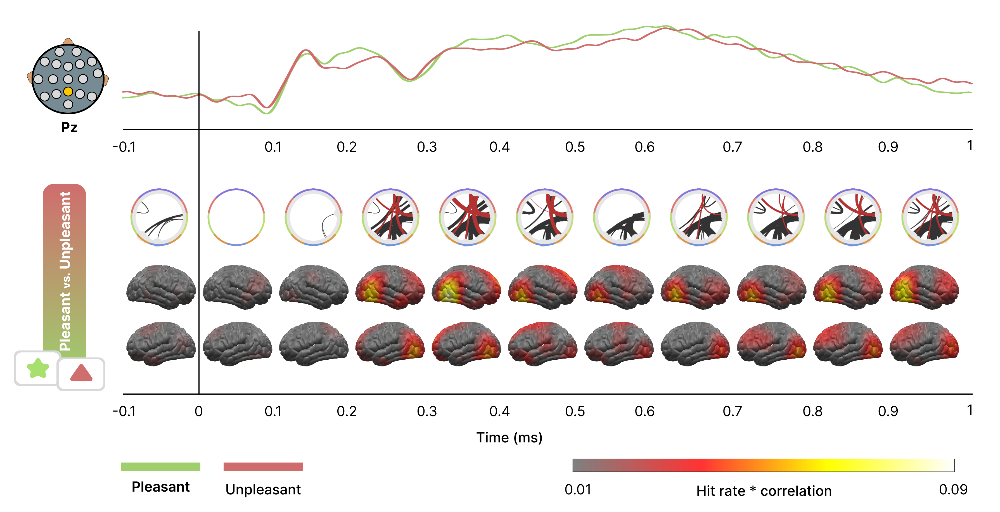

<br>
<br>
The Time-GAL toolbox offers a framework to investigate how a  cognitive  processing is shared within different brain regions. This toolbox computes the Generalization Across Location (GAL), a decoding-based methodology applying multi-variate pattern analysis (MVPA) to discriminate decodable information inlaid within the neural activity of the brain. Instead of using spatial information from electrodes or voxels, this methodology leverages the temporal neural dynamics, i.e. recording time-series, using this dimension as features for the MVPA-ased classifier model.

Conceptually, if a time-based decoder trained at location (channel, sensor or voxel) also classifies the data at other location, then we interpret this as evidence that the temporal dynamics at both locations contain shared decodable information about the conditions—a non-parametric way of describing spatial interdependency or connectivity. Therefore, we can visualize how different brain areas interacts between them during a cognitive or affective related task.

Furthermore, this toolbox computes not only the avobe mentioned spatial decoding backward model, but also a feedforward model of the temporal neural activity during the trial. Combining both, we can inspect how neural dynamics elaps over the trial showing not only the topographical brain aeras involved in the cognitive process, but also the precise generalization connectivity patterns between the brain areas across time.


## How it works

In the past decades, spatial information from neuroimaging recordings has been utilized to decode cognitive process during experimental tasks. Traditionally, the information contained in the voxels or electrodes served as features to train classifier models allowing to inspect the decoding outputs as time-series (see figure below, left part, left column). This approach takes the advantage of high spatial resolution tolls like fMRI, however other electrophysiological brain images such as MEG or EEG outstands in their temporal resolution instead of the spatial one. Thus, we develop a new approach employing the temporal information contained in the neural time-series as features for decoding algorithm to unveil the spatial involvement during the cognitive processing (see figure below, left part, right column).

Taking time as classifier input, this procedur allow us to inspect the GAL disposition of our data. GAL method is computed by training a classifier model using information from one channel and testing its capability to decode using data from other channels (see figure above, right part, B). This algorithms provides a generalization connectivity matrix. Moreover, a correlation between conditions labels and time-channel points are computed providing a correlation matrix that indicates the contribution of each channel in the time during the trial (see figure above, right part, C). Finally, the combination of both spatial (GAL connectivity patterns) and temporal (corelation matrix of weights) shed two intersting informations (see figure above, right part, D). First, we can observe the brain topography of the contributions along the time, like a video of how the brain is working during the trial (brains in figure below). Second, we can statistically analyze the significant GAL connectivity patterns and disentangling how they evolve over the time, explaining how brain regions interacts during a cognitive process (circular graphs in figure below).


## Live example

A live script example can be found in the toolbox explaining how the toolbox works (``` ExampleDecodingTimedGALscript.m ```). Also, a PDF copy of the procedure can be consulted (``` ExampleDecodingTimedGALscript.pdf ```). 
<br><br>
Data used for the example and results MATLAB objects can be found in <b> https://osf.io/q56ns </b>.

<b><br>

> #### Laboratory for Brain, Body, and Behavior
> University of Florida
